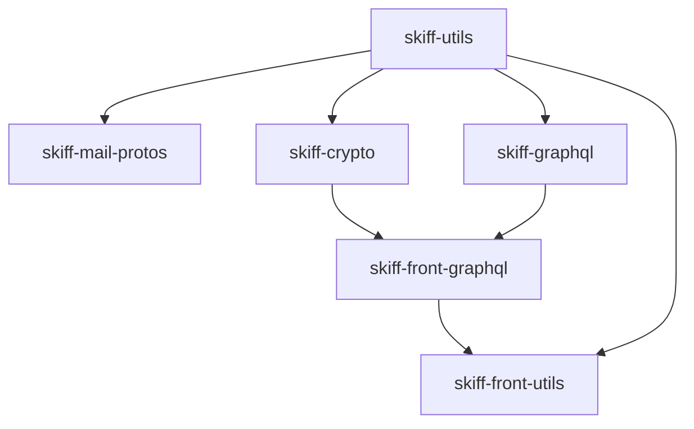

## Overview

Skiff uses a **Yarn workspaces** monorepo structure to manage multiple applications and shared libraries. This architecture enables code reuse, consistent tooling, and streamlined dependency management across all packages.

<Info>
  The monorepo uses Yarn Berry (v4.0.1) with workspace protocol for internal dependencies.
</Info>

## Workspace Configuration

The root `package.json` defines the workspace structure:

```json
{
  "workspaces": [
    "libs",
    "skemail-web",
    "calendar-web",
    "skiff-pages-drive",
    "skiff-calendar"
  ],
  "packageManager": "yarn@4.0.1"
}
```

## Repository Structure

```
skiff-apps/
├── libs/                      # Shared libraries workspace
│   ├── skiff-crypto/         # Core cryptography library
│   ├── skiff-crypto-v2/      # Updated crypto implementation
│   ├── skiff-utils/          # Shared utility functions
│   ├── skiff-front-utils/    # Frontend-specific utilities
│   ├── skiff-graphql/        # GraphQL schema & types
│   ├── skiff-front-graphql/  # Frontend GraphQL utilities
│   ├── skiff-mail-protos/    # Protocol buffer definitions
│   ├── skiff-ics/            # iCalendar format utilities
│   ├── skiff-front-search/   # Search functionality
│   ├── skiff-prosemirror/    # Rich text editor utilities
│   ├── nightwatch-ui/        # UI component library
│   └── eslint-config-skiff-eslint/  # Shared ESLint config
├── skemail-web/              # Skiff Mail web application
├── calendar-web/             # Skiff Calendar web application
├── skiff-pages-drive/        # Skiff Pages & Drive
├── protos/                   # Protocol buffer source files
└── package.json              # Root workspace configuration
```

## Libraries Workspace

The `libs/` directory is itself a workspace containing multiple packages. Each library serves a specific purpose:

### Core Libraries

<AccordionGroup>
  <Accordion title="skiff-crypto" icon="lock">
    Core cryptography library providing end-to-end encryption primitives:
    - Public key cryptography
    - Symmetric encryption
    - Key derivation
    - Digital signatures

    Used by all applications for secure data handling.
  </Accordion>

  <Accordion title="skiff-crypto-v2" icon="key">
    Updated cryptography implementation with improved algorithms and performance.
    Gradually replacing v1 across the codebase.
  </Accordion>

  <Accordion title="skiff-utils" icon="toolbox">
    Fundamental utilities shared across all packages:
    - Date/time helpers
    - String formatting
    - Validation utilities
    - Constants and enums

    **Built first** in the dependency chain.
  </Accordion>

  <Accordion title="skiff-front-utils" icon="browser">
    Frontend-specific utilities:
    - React hooks
    - Browser storage helpers
    - UI state management
    - Email formatting functions

    Depends on `skiff-utils`.
  </Accordion>
</AccordionGroup>

### Data & API Libraries

<AccordionGroup>
  <Accordion title="skiff-graphql" icon="diagram-project">
    GraphQL schema definitions and type resolvers:
    - Type definitions
    - GraphQL resolvers
    - API contracts

    Shared between frontend and backend.
  </Accordion>

  <Accordion title="skiff-front-graphql" icon="code">
    Frontend GraphQL utilities:
    - Apollo Client setup
    - Query/mutation hooks
    - Cache configuration
    - GraphQL code generation
  </Accordion>

  <Accordion title="skiff-mail-protos" icon="file-code">
    Compiled Protocol Buffer definitions for:
    - Email message structures
    - Encrypted data formats
    - API message types

    Generated from `.proto` files in the `protos/` directory.
  </Accordion>

  <Accordion title="skiff-ics" icon="calendar">
    iCalendar (ICS) format parsing and generation:
    - ICS file parsing
    - Event serialization
    - Calendar import/export

    Used primarily by calendar-web.
  </Accordion>
</AccordionGroup>

### UI & Editor Libraries

<AccordionGroup>
  <Accordion title="nightwatch-ui" icon="palette">
    Shared UI component library:
    - Design system components
    - Themed components
    - Consistent styling

    Used across all web applications.
  </Accordion>

  <Accordion title="skiff-prosemirror" icon="text">
    Rich text editor utilities built on ProseMirror:
    - Custom schema definitions
    - Editor plugins
    - Text formatting utilities

    Powers the email composer and document editor.
  </Accordion>

  <Accordion title="skiff-front-search" icon="magnifying-glass">
    Client-side search functionality:
    - Index management
    - Search algorithms
    - Query parsing
  </Accordion>
</AccordionGroup>

### Tooling Libraries

<AccordionGroup>
  <Accordion title="eslint-config-skiff-eslint" icon="check">
    Shared ESLint configuration:
    - Code style rules
    - TypeScript rules
    - React-specific rules

    Ensures consistent code quality across packages.
  </Accordion>
</AccordionGroup>

## Application Packages

### skemail-web

The Skiff Mail web application built with:
- **Framework**: Custom Webpack setup (not Next.js)
- **UI**: React 17 with styled-components
- **State**: Redux Toolkit
- **Editor**: TipTap (ProseMirror-based)

**Dependencies on libs**:
```json
{
  "skiff-crypto": "workspace:libs/skiff-crypto",
  "skiff-crypto-v2": "workspace:libs/skiff-crypto-v2",
  "skiff-front-graphql": "workspace:libs/skiff-front-graphql",
  "skiff-front-search": "workspace:libs/skiff-front-search",
  "skiff-front-utils": "workspace:libs/skiff-front-utils",
  "skiff-graphql": "workspace:libs/skiff-graphql",
  "skiff-mail-protos": "workspace:libs/skiff-mail-protos",
  "skiff-utils": "workspace:libs/skiff-utils",
  "nightwatch-ui": "workspace:libs/nightwatch-ui"
}
```

### calendar-web

The Skiff Calendar web application with similar architecture to skemail-web:
- **Framework**: Custom Webpack setup
- **UI**: React 17 with styled-components
- **State**: Redux Toolkit
- **Storage**: Dexie (IndexedDB wrapper)

**Key differences**:
- Uses `skiff-ics` for calendar format handling
- Integrates with Google Calendar API
- Uses IndexedDB for offline storage

## Build Order & Dependencies

Libraries must be built in **topological order** due to interdependencies:



Build command (from `libs/package.json`):

```bash
yarn workspace skiff-utils build && \
yarn workspace skiff-mail-protos build && \
yarn workspace skiff-graphql build && \
yarn workspace @skiff-org/skiff-crypto build && \
yarn workspace skiff-front-graphql build && \
yarn workspace skiff-front-utils build
```

<Warning>
  Always build libraries before running applications. Applications depend on compiled library output.
</Warning>

## Workspace Protocol

The monorepo uses Yarn's `workspace:` protocol for internal dependencies:

```json
{
  "dependencies": {
    "skiff-utils": "workspace:libs/skiff-utils"
  }
}
```

This enables:
- **Development**: Direct linking to source code
- **Type safety**: TypeScript resolves to actual source
- **Hot reloading**: Changes in libraries reflect immediately

## Shared Dependencies

Common dependencies are hoisted to the root `package.json`:

### Development Tools
- **TypeScript** 5.0.0
- **Jest** 28.1.1 with SWC
- **ESLint** 8.x
- **Prettier** 2.x

### Testing Libraries
- `@testing-library/react` 12.1.2
- `@testing-library/react-hooks` 7.0.2
- `@testing-library/jest-dom` 5.16.2
- `@testing-library/user-event` 14.1.1

### Build Tools
- **Babel** 7.x with TypeScript preset
- **GraphQL Code Generator**
- **Protocol Buffers** compiler

## Working with Workspaces

### Run commands in specific workspace

```bash
yarn workspace <workspace-name> <command>
```

Examples:
```bash
yarn workspace skemail-web dev
yarn workspace libs build
yarn workspace calendar-web test
```

### Run commands in all workspaces

```bash
yarn workspaces foreach <command>
```

Examples:
```bash
yarn workspaces foreach run build
yarn workspaces foreach run test
```

### Add dependency to specific workspace

```bash
yarn workspace <workspace-name> add <package>
```

## Best Practices

<CardGroup cols={2}>
  <Card title="Library Changes" icon="book">
    When modifying libraries, rebuild them before testing in applications:
    ```bash
    yarn build:lib
    ```
  </Card>

  <Card title="New Dependencies" icon="box">
    Add shared dependencies to root `package.json`. Add package-specific dependencies to the package's own `package.json`.
  </Card>

  <Card title="Type Safety" icon="shield">
    Export types from libraries in their `index.ts` to maintain clean public APIs.
  </Card>

  <Card title="Circular Dependencies" icon="circle-notch">
    Avoid circular dependencies between libraries. Use the `yarn lint:cycles` command to detect them.
  </Card>
</CardGroup>

## Next Steps

<CardGroup cols={2}>
  <Card title="Development Setup" icon="laptop-code" href="/development/setup">
    Set up your development environment
  </Card>
  <Card title="Contributing" icon="code-pull-request" href="/development/contributing">
    Learn how to contribute code
  </Card>
</CardGroup>
