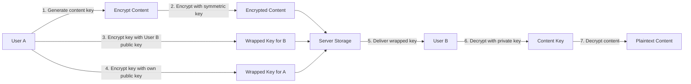

# Skiff Security Model

Skiff's security architecture is built on the principle of **zero-knowledge encryption**, where your data is encrypted on your device before it ever reaches Skiff servers. This ensures that even Skiff cannot access your private information.

<Note>
For a comprehensive technical analysis, read the full [Skiff whitepaper](https://skiff.com/whitepaper) which documents the complete cryptographic protocol.
</Note>

## End-to-End Encryption Architecture

Skiff uses a hybrid encryption approach combining both symmetric and asymmetric cryptography to provide security, performance, and key sharing capabilities.

### Encryption Flow

<Steps>
  <Step title="Key Generation">
    When you create a Skiff account, your device generates a public/private key pair that never leaves your device unencrypted
  </Step>
  <Step title="Content Encryption">
    All content (emails, documents, files) is encrypted with randomly generated symmetric keys using ChaCha20Poly1305
  </Step>
  <Step title="Key Wrapping">
    Symmetric keys are encrypted with your public key (and recipients' public keys for sharing) using TweetNaCl asymmetric encryption
  </Step>
  <Step title="Server Storage">
    Only encrypted content and encrypted keys are stored on Skiff servers - the plaintext never leaves your device
  </Step>
</Steps>

## Cryptographic Primitives

Skiff's encryption is built on the `skiff-crypto` library, which provides audited cryptographic functions.

### Symmetric Encryption

Skiff uses **ChaCha20Poly1305** for symmetric encryption of content:

<Accordion title="ChaCha20Poly1305 Details">
  ChaCha20Poly1305 is an authenticated encryption algorithm that provides:
  
  - **Confidentiality**: 256-bit ChaCha20 stream cipher
  - **Integrity**: Poly1305 MAC for authentication
  - **Performance**: Optimized for both hardware and software implementations
  - **Security**: Resistant to timing attacks
  
  ```typescript
  // From libs/skiff-crypto/src/aead
  import { ChaCha20Poly1305 } from '@stablelib/chacha20poly1305';
  
  export function encryptSymmetric(
    plaintext: string,
    key: Uint8Array,
    datagram: Datagram
  ): string {
    const cipher = new ChaCha20Poly1305(key);
    const nonce = generateRandomBytes(12); // 96-bit nonce
    const ciphertext = cipher.seal(nonce, plaintextBytes);
    return encodeDatagram(ciphertext, nonce, datagram);
  }
  ```
</Accordion>

### Asymmetric Encryption

Skiff uses **TweetNaCl** (based on Curve25519) for asymmetric encryption:

<Accordion title="TweetNaCl Implementation">
  TweetNaCl provides high-security public-key cryptography:
  
  - **Key Exchange**: X25519 Elliptic Curve Diffie-Hellman
  - **Encryption**: XSalsa20 stream cipher with Poly1305 MAC
  - **Signatures**: Ed25519 for digital signatures
  - **Security**: 128-bit security level
  
  ```typescript
  // From libs/skiff-crypto/src/asymmetricEncryption.ts
  import nacl from 'tweetnacl';
  
  export function generatePublicPrivateKeyPair(): KeyPair {
    const keyPair = nacl.box.keyPair();
    return {
      publicKey: keyPair.publicKey,
      privateKey: keyPair.secretKey
    };
  }
  
  export function stringEncryptAsymmetric(
    privateKey: Uint8Array,
    publicKey: PublicKey,
    plaintext: string
  ): string {
    const nonce = nacl.randomBytes(nacl.box.nonceLength);
    const ciphertext = nacl.box(
      plaintextBytes,
      nonce,
      publicKey.key,
      privateKey
    );
    return encodeEncryptedData(ciphertext, nonce);
  }
  ```
</Accordion>

### Hash Functions

For integrity verification and key derivation:

```typescript
// From libs/skiff-crypto/src/hash.ts
import { createHash } from 'crypto';

export function generateHash(data: string): string {
  return createHash('sha512')
    .update(data)
    .digest('hex');
}
```

Skiff uses **SHA-512** for:
- Content integrity verification
- Deterministic key derivation
- Message authentication

## Key Management

Skiff's key management system is designed to be secure, recoverable, and user-friendly.

### Key Types

<CardGroup cols={2}>
  <Card title="User Key Pair" icon="key">
    Long-term Ed25519/X25519 key pair for identity and asymmetric encryption
  </Card>
  <Card title="Symmetric Content Keys" icon="lock">
    Per-object random symmetric keys for encrypting actual content
  </Card>
  <Card title="Session Keys" icon="clock">
    Temporary keys for encrypted communication sessions
  </Card>
  <Card title="Recovery Keys" icon="shield">
    Backup keys for account recovery stored securely offline
  </Card>
</CardGroup>

### Key Derivation

User passwords are processed through **Argon2** for key derivation:

```typescript
// From libs/skiff-crypto dependencies
import argon2 from 'argon2-browser';

// Password-based key derivation
const derivedKey = await argon2.hash({
  pass: password,
  salt: salt,
  type: argon2.ArgonType.Argon2id,
  hashLen: 32,
  mem: 65536,      // 64 MB memory
  time: 3,         // 3 iterations
  parallelism: 4   // 4 parallel threads
});
```

<Warning>
Argon2id is used specifically because it provides resistance to both side-channel attacks and GPU cracking attempts.
</Warning>

### Key Storage

Keys are stored securely using multiple layers:

1. **Browser Storage**: IndexedDB via `idb-keyval` for encrypted local storage
2. **Encryption at Rest**: Keys are encrypted with password-derived keys before storage
3. **Server Backup**: Encrypted key backups (encrypted with recovery key) stored server-side
4. **Hardware Security**: Support for WebAuthn for hardware-backed key storage

## Datagram System

Skiff uses a custom **datagram** system for versioned, authenticated encrypted data structures:

<Accordion title="Datagram Architecture">
  Datagrams wrap encrypted data with metadata for versioning and integrity:
  
  ```typescript
  // From libs/skiff-crypto/src/datagramBuilders.ts
  export interface Datagram {
    header: string;        // Type identifier (e.g., 'ddl://mail-v1')
    body: Uint8Array;      // Encrypted content
    version: number;       // Schema version
    checksum: string;      // Integrity hash
  }
  
  export function createJSONWrapperDatagram(header: string): Datagram {
    return {
      header,
      encryptionVersion: CURRENT_VERSION,
      body: encryptAndSerialize(data),
      checksum: generateChecksum(data)
    };
  }
  ```
  
  Benefits:
  - **Version Migration**: Automatic handling of old encryption formats
  - **Integrity**: Built-in checksums prevent tampering
  - **Type Safety**: Header identifies data type and schema
  - **Compression**: Automatic compression with `fflate`
</Accordion>

## Sharing and Collaboration

When sharing encrypted content with other users, Skiff implements secure key sharing:

### Sharing Flow



<Steps>
  <Step title="Content Encryption">
    The content is encrypted once with a random symmetric key
  </Step>
  <Step title="Key Wrapping">
    The symmetric key is encrypted separately for each recipient using their public key
  </Step>
  <Step title="Server Distribution">
    Server stores one copy of encrypted content and multiple wrapped keys
  </Step>
  <Step title="Recipient Decryption">
    Each recipient decrypts their wrapped key with their private key, then decrypts the content
  </Step>
</Steps>

## Signature and Authentication

Skiff uses **Ed25519** digital signatures for authentication:

```typescript
// From libs/skiff-crypto/src/signature.ts
import nacl from 'tweetnacl';

export function signDetached(
  message: Uint8Array,
  signingPrivateKey: Uint8Array
): Uint8Array {
  return nacl.sign.detached(message, signingPrivateKey);
}

export function verifyDetached(
  message: Uint8Array,
  signature: Uint8Array,
  signingPublicKey: Uint8Array
): boolean {
  return nacl.sign.detached.verify(
    message,
    signature,
    signingPublicKey
  );
}
```

Signatures are used for:
- **Message Authentication**: Verify email sender identity
- **Document Integrity**: Ensure documents haven't been tampered with
- **Key Verification**: Validate public key ownership

## Security Best Practices

<CardGroup cols={2}>
  <Card title="Zero-Knowledge Architecture" icon="eye-slash">
    Skiff servers never have access to unencrypted content or encryption keys
  </Card>
  <Card title="Open Source" icon="code">
    All cryptographic code is open source and available for audit on GitHub
  </Card>
  <Card title="Audited Libraries" icon="certificate">
    Uses well-audited libraries like TweetNaCl and StableLib for core cryptography
  </Card>
  <Card title="Forward Secrecy" icon="forward">
    Session keys are ephemeral and rotated regularly
  </Card>
</CardGroup>

## Threat Model

Skiff's encryption protects against several threat scenarios:

### What Skiff Protects Against

<Accordion title="Server Compromise">
  Even if Skiff servers are compromised, attackers cannot decrypt user data because encryption keys are never stored unencrypted on servers.
</Accordion>

<Accordion title="Network Eavesdropping">
  All communication uses TLS, and content is encrypted end-to-end, so network-level attackers only see encrypted data.
</Accordion>

<Accordion title="Malicious Insiders">
  Skiff employees cannot access user data because it's encrypted with keys only users possess.
</Accordion>

<Accordion title="Legal Requests">
  Skiff can only provide encrypted data to legal authorities - plaintext data is mathematically inaccessible.
</Accordion>

### What Skiff Cannot Protect Against

<Warning>
Skiff's encryption model has limitations:

- **Device Compromise**: If your device is compromised, attackers may access keys stored on it
- **Phishing**: Users can be tricked into entering passwords on fake websites
- **Weak Passwords**: Password-derived keys are only as strong as the password
- **Malicious Browser Extensions**: Extensions with broad permissions could intercept data
</Warning>

## Security Audits

Skiff's cryptographic implementation has been:

- Built on **audited libraries** (TweetNaCl, StableLib)
- Designed following **NIST cryptographic standards**
- **Open sourced** for community review
- Implemented with **defense in depth** principles

<Tip>
Report security vulnerabilities to security@skiff.org. Skiff takes security issues seriously and will work with researchers to verify and fix issues promptly.
</Tip>

## Technical References

For developers implementing Skiff-compatible applications or auditing security:

- **Source Code**: [github.com/skiff-org/skiff-apps](https://github.com/skiff-org/skiff-apps)
- **Crypto Library**: libs/skiff-crypto directory contains all cryptographic primitives
- **Whitepaper**: [skiff.com/whitepaper](https://skiff.com/whitepaper)
- **Blog**: [skiff.com/blog/private-search](https://skiff.com/blog/private-search) for search implementation

### Key Files to Review

| File | Purpose |
|------|---------|
| `libs/skiff-crypto/src/asymmetricEncryption.ts` | TweetNaCl asymmetric encryption wrapper |
| `libs/skiff-crypto/src/aead/` | ChaCha20Poly1305 symmetric encryption |
| `libs/skiff-crypto/src/keys.ts` | Key generation and management |
| `libs/skiff-crypto/src/signature.ts` | Ed25519 digital signatures |
| `libs/skiff-crypto/src/datagramBuilders.ts` | Versioned encrypted data structures |

<Info>
All cryptographic operations are performed client-side using WebCrypto API and WebAssembly where available for performance and security.
</Info>
